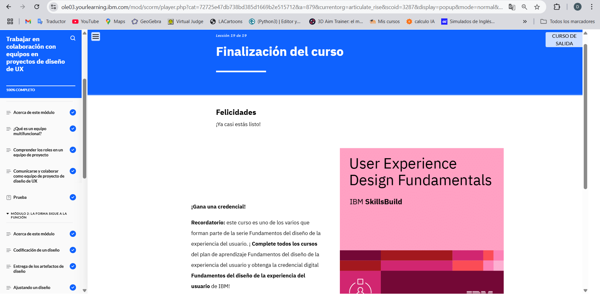

# Modulo 6
## Working Collaboratively with Teams on UX Design Projects

En el Módulo 6 aprendí sobre el trabajo en equipos multidisciplinarios en proyectos de UX, la colaboración con desarrolladores y la entrega de artefactos de diseño. También exploré la revisión de productos desarrollados y analicé un caso de estudio sobre un e-commerce de plantas.
