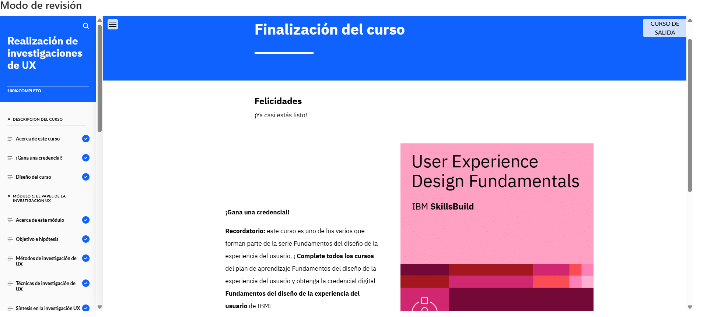

# Modulo 2
## Conducting UX Research

En el Módulo 2 aprendí a investigar usuarios, crear personas y analizar la competencia para un diseño UX efectivo. También comprendí la importancia de las hipótesis y la síntesis de datos, aplicándolo en un caso de estudio sobre un e-commerce de plantas.

