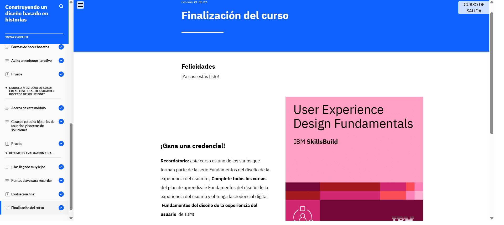

# Modulo 3
## Building a Story-based Design

En el Módulo 3 aprendí a crear historias de usuario para capturar necesidades y preferencias, convirtiéndolas en flujos, recorridos y bocetos de solución. También exploré su aplicación en UX y analicé un caso de estudio sobre un e-commerce de plantas.

