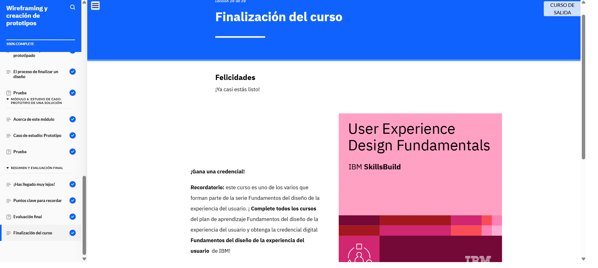

# Modulo 4
## Wireframing and Prototyping

En el Módulo 4 aprendí sobre escritura UX, arquitectura de la información y mapas de sitio. También exploré el proceso de wireframing, el diseño de interfaces y la creación de prototipos para mejorar la accesibilidad. Finalmente, analicé un caso de estudio sobre un e-commerce de plantas.
