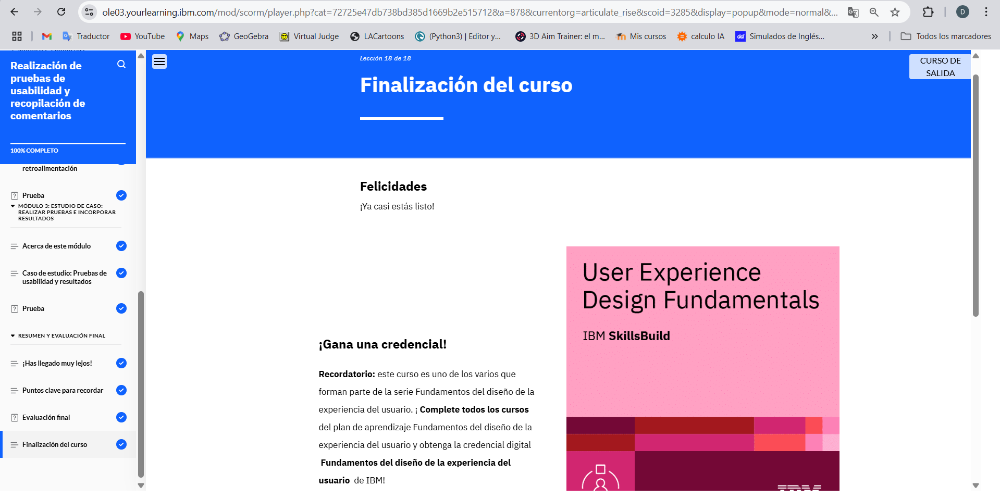

# Modulo 5
## Conducting Usability Tests and Gathering Feedback

En el Módulo 5 aprendí a evaluar diseños mediante pruebas de usabilidad, identificar métodos cualitativos y cuantitativos, y priorizar el feedback para mejorar prototipos. Finalmente, analicé un caso de estudio sobre pruebas y ajustes en un e-commerce de plantas.
