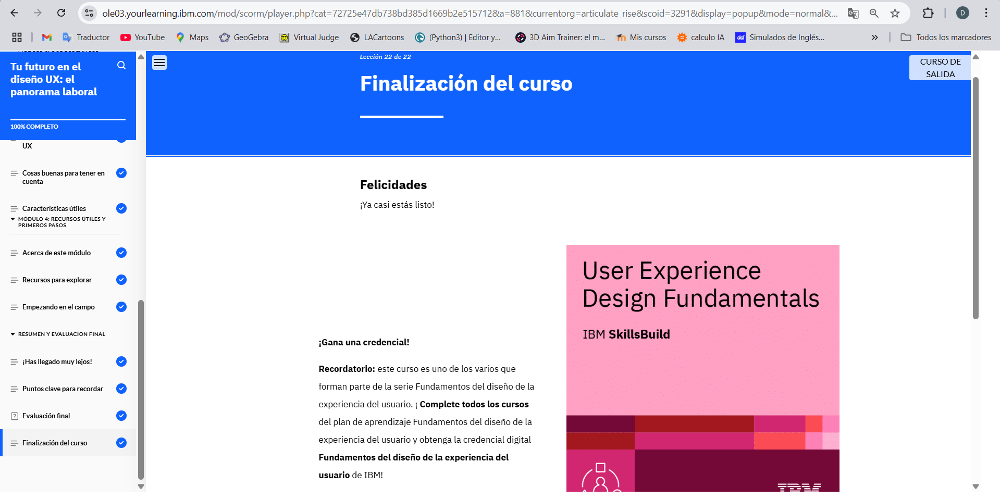

# Modulo 7
## Your Future in UX Design: The Job Landscape

En el Módulo 7 aprendí sobre el mercado laboral en UX, las habilidades y responsabilidades clave de un diseñador UX, y cómo se diferencia de otros diseñadores. También exploré las oportunidades de aprendizaje para seguir creciendo en el campo.
